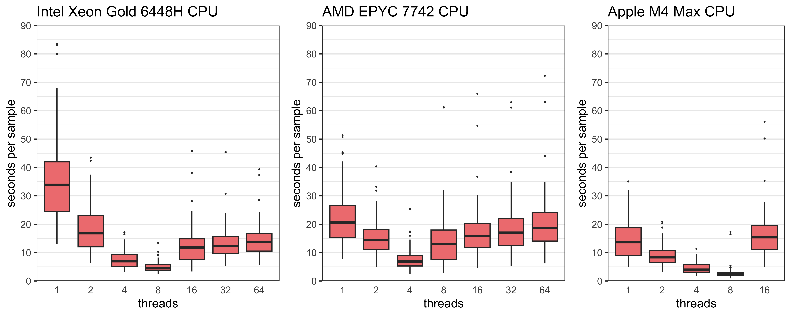

## Benchmarking of run time for Mykrobe
We investigated the average run time for Typhi Mykrobe to demonstrate the rapid time to a result. Here we used 100 Typhi genomes from the short read data. These were randomly selected but included at least one genome from each genotype and a diversity of AMR and plasmid profiles. The `mykrobe predict` command was run for the 100 Typhi genomes on three different computers where both the run time and RAM were recorded. The number of threads was also varied from 1 to 64 threads for the two HPC and 1 to 16 for the Mac laptop.  

We demonstrate that the run time for Typhi Mykrobe’s `mykrobe predict` command on a modern computer was <1minute to complete (Supplementary Figure 2). The `mykrobe predict` command can be run with multiple threads using the `--threads`/`-t` option. Up to ~4 threads will increase performance. Using multiple threads on a very fast CPU, the run time for each genome was reduced to seconds (Supplementary Figure 2). Further, `mykrobe predict` is very memory-efficient and will typically use less than 100 MB of RAM per genome. 

Supplementary Figure 2: Run-time of Typhi Mykrobe of 100 Typhi genomes 
The run time for 100 Typhi genomes on three different computers. The number of threads used is shown on the x-axis. The time (seconds per sample) to run on each genome is shown on the y axis. Boxes show the interquartile range (IQR), horizontal lines indicate the median, whiskers extend to 1.5×IQR and values beyond this range are shown as outliers.

